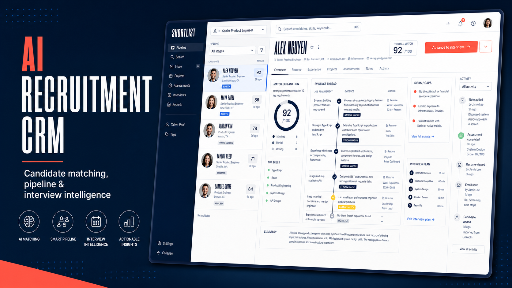
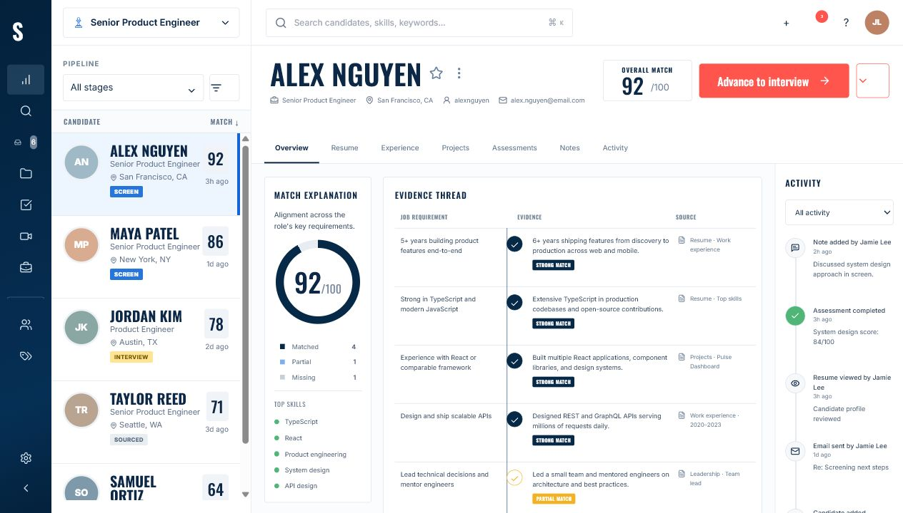
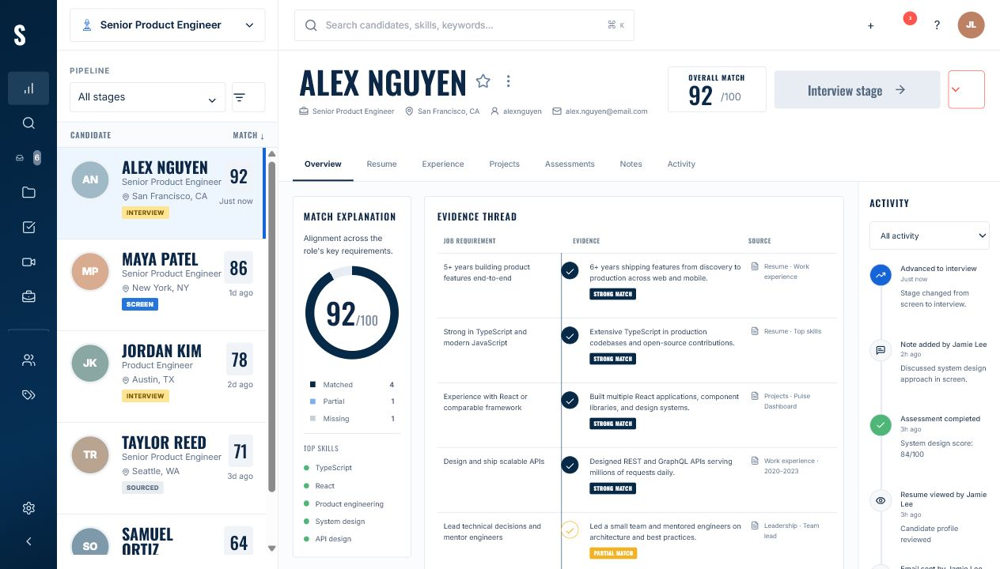
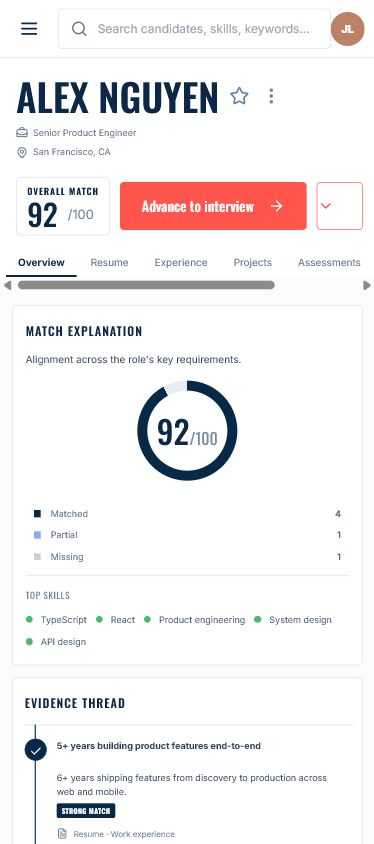

# Shortlist

Shortlist is a portfolio-ready AI recruitment CRM concept built with Next.js. It turns candidate matching into an explainable hiring workflow: recruiters can search a realistic pipeline, compare evidence against role requirements, inspect risks, review activity, and advance candidates without leaving the workspace.

## Product Highlights

- Five realistic candidate profiles with role, location, stage, score, skills, risks, interview plans, and activity
- Search across candidates, locations, stages, and skills
- Pipeline stage filtering and role selection
- Candidate selection with fully updated details and match evidence
- Explainable score breakdown with matched, partial, and missing evidence
- Signature evidence thread connecting every requirement to a source
- Meaningful candidate tabs for resume, experience, projects, assessments, notes, and activity
- Working "Advance to interview" flow with local state updates, timeline event, disabled completed state, and confirmation toast
- Responsive desktop workspace and mobile candidate drawer
- Keyboard focus treatments and reduced-motion support

## Stack

- Next.js 16 App Router
- React 19 and TypeScript
- Tailwind CSS build pipeline with a custom product UI stylesheet
- Lucide React icons
- Local deterministic product data; no API or account required

## Setup

```bash
npm install
npm run dev
```

Open [http://localhost:3000](http://localhost:3000).

Production checks:

```bash
npm run lint
npm run build
```

## Screenshots

### Portfolio cover



### Desktop workspace



### Candidate advancement



### Mobile workspace



The visual source concept is maintained outside this repository in the project design workspace.

## Architecture

`app/page.tsx` owns the small amount of demo state: selection, search, filters, tabs, mobile drawer, and candidate advancement. Domain data and types live in `lib/`, while the interface is divided by product responsibility:

- `Sidebar` - primary product navigation
- `CandidateList` - role, search, pipeline filters, and candidate selection
- `CandidateDetail` - profile header, tabs, and action flow
- `ScoreCard` - explainable score summary and strengths
- `EvidenceThread` - requirement-to-evidence traceability
- `InsightRail` - risks and interview plan
- `ActivityRail` - chronological hiring history

The data model is intentionally API-shaped, making it straightforward to replace local records with server components, route handlers, or an ATS integration.

## Production Extension Notes

For a production build, the next layer would add:

1. Persistent candidate, role, stage, and activity storage in PostgreSQL.
2. Authentication, organization tenancy, role-based permissions, and audit logs.
3. ATS/email/calendar integrations and webhook-driven activity ingestion.
4. Server-side search, pagination, saved filters, and pipeline analytics.
5. Structured resume parsing with source citations and model evaluation.
6. Human-review controls, score calibration, bias monitoring, and explainability policies.
7. Optimistic server mutations for stage changes with rollback and error states.
8. Component, accessibility, and end-to-end tests for critical hiring flows.

AI recommendations should support recruiter judgment, not make autonomous employment decisions. Production use requires legal review, consent and retention controls, accessibility validation, and regular fairness audits.
